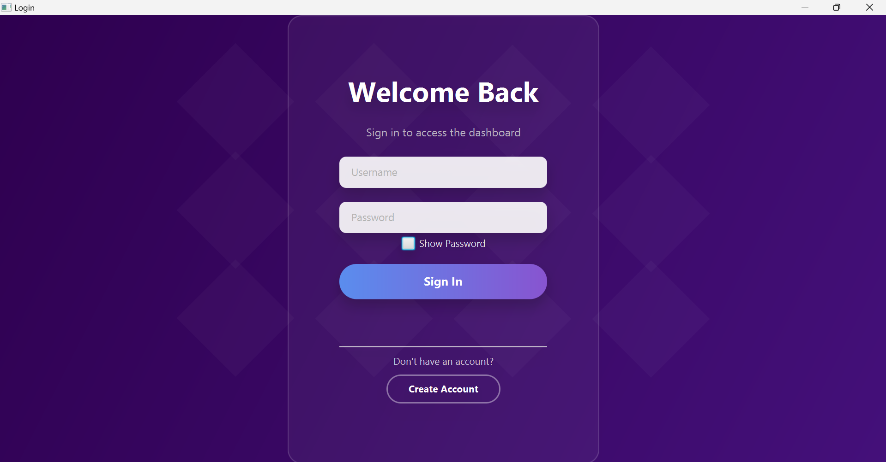
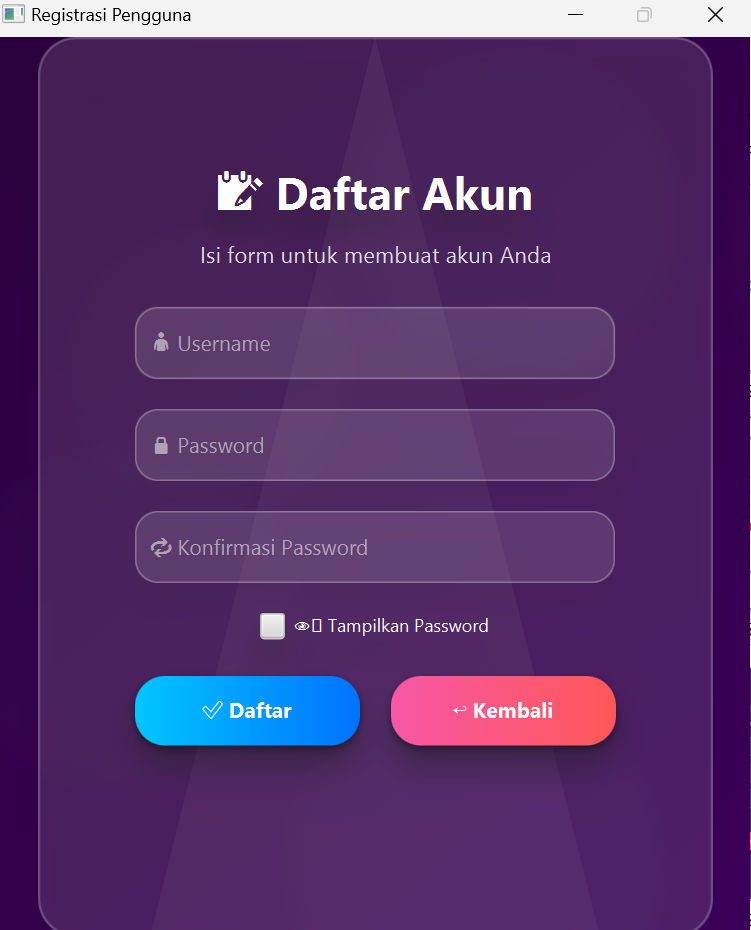
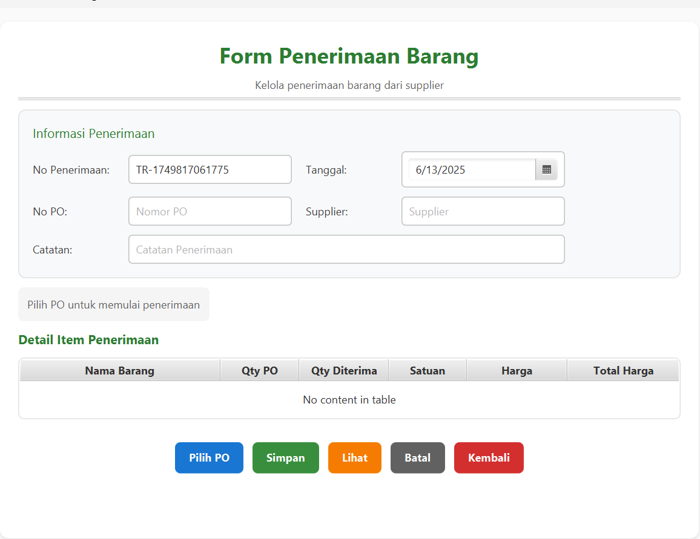
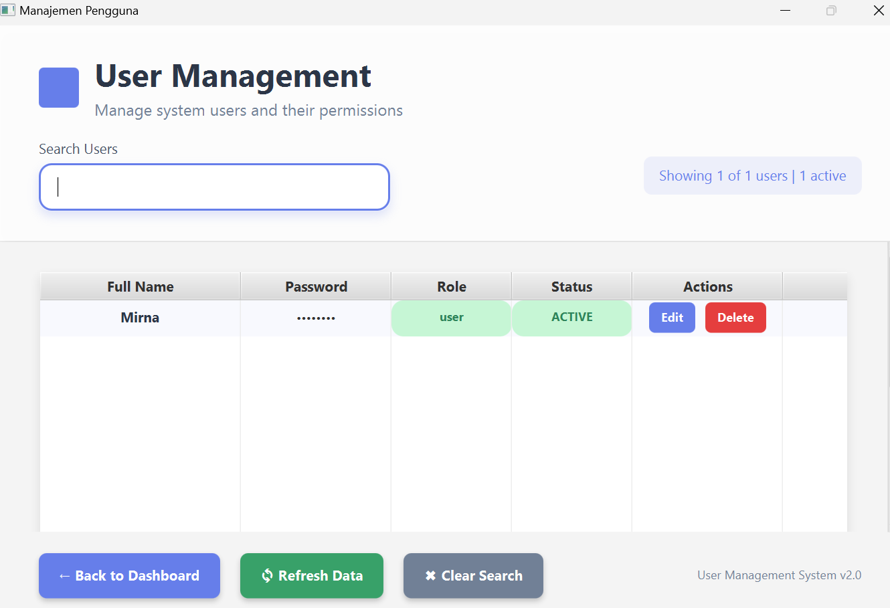
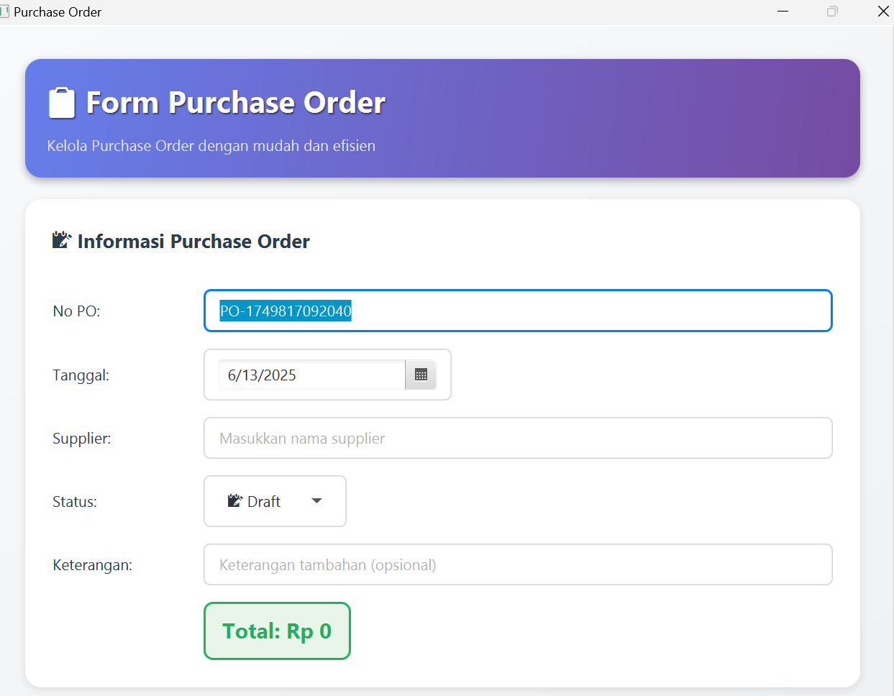
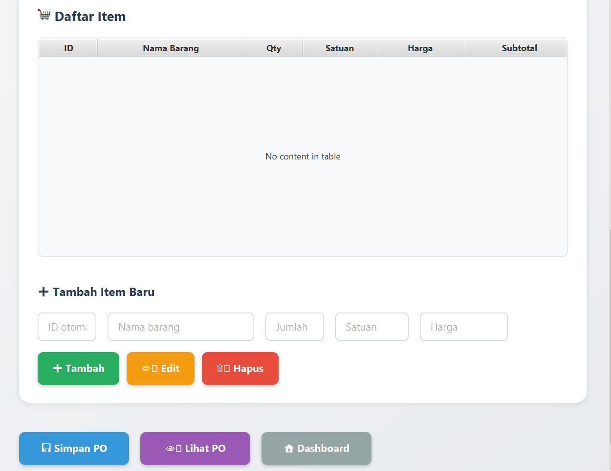
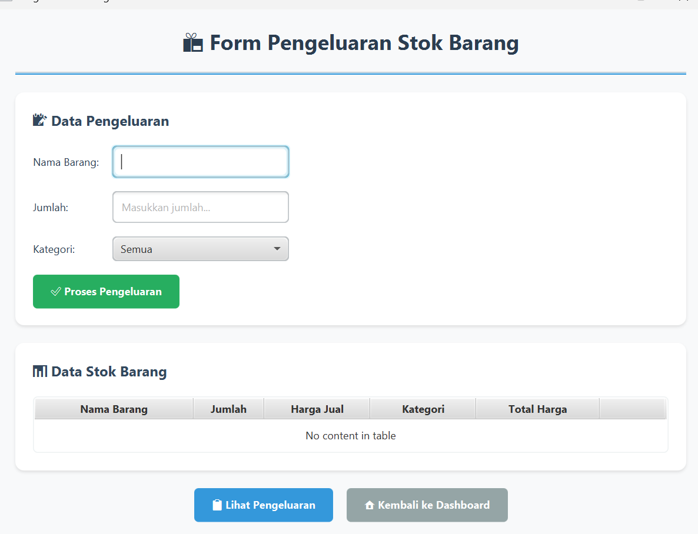
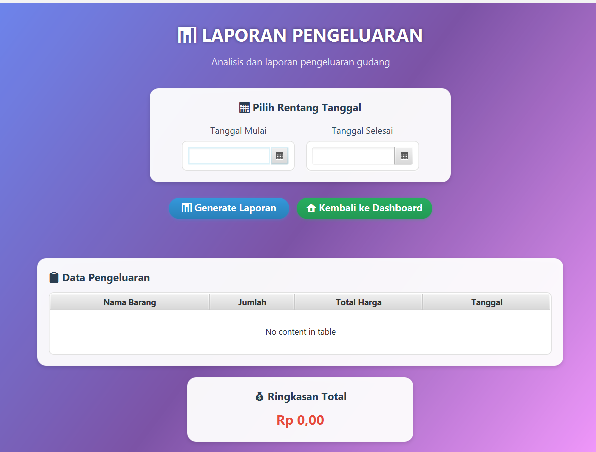
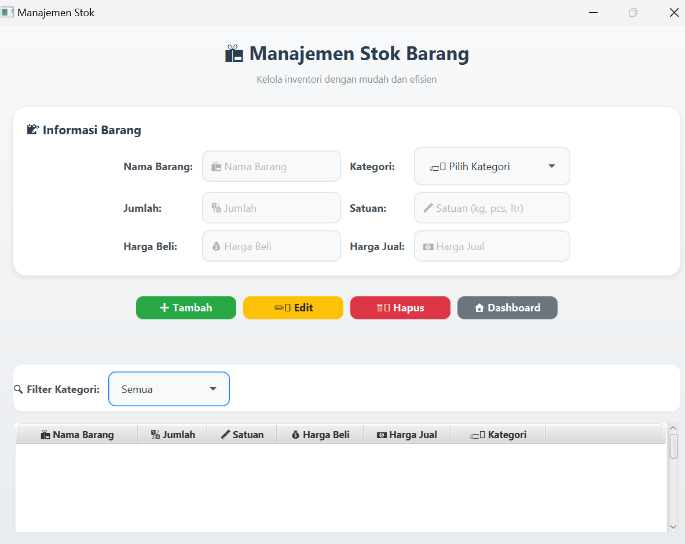

# Logistik
# 📦 Pergudangan - Aplikasi Logistik
Modul ini merupakan bagian dari sistem **Aplikasi Logistik** yang berfokus pada proses **manajemen pergudangan**. Tujuan utamanya adalah untuk mengelola arus keluar masuk barang di gudang secara efektif dan efisien, serta meminimalkan kesalahan pencatatan dan kehilangan stok.

---
# 🧾 Fitur Aplikasi
### 1. **Login**
**Deskripsi**:  
Halaman awal untuk masuk ke dalam sistem manajemen pergudangan.
### 🔧 Fitur:
- 🔐 **Form Login:**
  - Input `Username`
  - Input `Password`

- 👁️‍🗨️ **Show Password:**
  - Checkbox untuk menampilkan atau menyembunyikan teks password.

- 🔓 **Sign In:**
  - Tombol untuk memverifikasi akun dan mengakses dashboard pengguna.

- ➕ **Create Account:**
  - Tombol navigasi menuju halaman registrasi akun baru.

### 🧑‍💼 UI Login

---

### 2. **Registrasi Pengguna**
**Deskripsi**:  
Form untuk membuat akun baru pengguna aplikasi.

### 🔧 Fitur:
- 📋 **Form Registrasi:**
  - Input `Username`
  - Input `Password`
  - Input `Konfirmasi Password`

- 👁️ **Tampilkan Password:**
  - Checkbox untuk menampilkan password dan konfirmasi password.

- ✅ **Daftar:**
  - Tombol untuk menyimpan akun baru ke sistem.

- ↩️ **Kembali:**
  - Tombol untuk kembali ke halaman login.

### 🧑‍💼 UI Registrasi

---

### 3. **Penerimaan Barang (Goods Receiving)**
Form to record goods received based on existing Purchase Orders (PO).

**Main Components:**
- **Auto-generated No Penerimaan**
- **Date Picker** for Tanggal
- **Supplier and No PO Selector**
- **Catatan Field** (Notes)
- **Tabel Detail Barang:**
  - Nama Barang
  - Qty PO
  - Qty Diterima
  - Satuan
  - Harga
  - Total Harga
- **Action Buttons:**
  - Pilih PO
  - Simpan
  - Lihat
  - Batal
  - Kembali
  - 
### 🧑‍💼 UI Penerimaan Barang

---

### 4. **Manajemen Pengguna (User Management)**
Form to manage system users with role-based access.

**Main Components:**
- **Search Bar** to filter users
- **User Table:**
  - Full Name
  - Password (hidden)
  - Role
  - Status
  - Edit / Delete actions
- **Action Buttons:**
  - Back to Dashboard
  - Refresh Data
  - Clear Search

### 🧑‍💼 UI User Management

---

### 5. **Purchase Order (PO) Management**
Create and manage purchase orders for suppliers.

**Main Components:**
- **Auto-generated No PO**
- **Date Picker** for PO date
- **Supplier Dropdown**
- **Keterangan Field** (Notes)
- **Status PO Display**
- **PO Items Table:**
  - ID
  - Nama Barang
  - Qty
  - Satuan
  - Harga
  - Subtotal
- **Item Input Form** (to add/edit items)
- **Total PO Cost** displayed at bottom
- **Action Buttons:**
  - Tambah / Edit / Hapus Item
  - Simpan PO
  - Lihat PO
  - Dashboard

### 🧑‍💼 UI Purchase Order (PO)


---

### 6. **Pengeluaran Barang (Stock Out)**
Form to process outgoing inventory based on item name and category.

**Main Components:**
- **Input Fields:**
  - Nama Barang
  - Jumlah
  - Kategori
- **Stock Table:**
  - Nama Barang
  - Jumlah
  - Harga Jual
  - Kategori
  - Total Harga
- **Action Buttons:**
  - Proses Pengeluaran
  - Lihat Pengeluaran
  - Kembali ke Dashboard

### UI Pengeluaran Barang

---

## 7. **Fitur Laporan Pengeluaran**
**Tampilan:** Laporan Pengeluaran  
**Deskripsi:** Menyajikan laporan analisis pengeluaran gudang berdasarkan rentang tanggal.
### Fitur:
- 📅 **Pilih Rentang Tanggal:**
  - Input **Tanggal Mulai** dan **Tanggal Selesai** dengan kalender (date picker).

- 📈 **Generate Laporan:**
  - Tombol untuk memproses dan menampilkan data pengeluaran.

- 🔙 **Kembali ke Dashboard:**
  - Navigasi ke halaman utama.

- 📋 **Tabel Data Pengeluaran:**
  - Menampilkan data:
    - Nama Barang
    - Jumlah
    - Total Harga
    - Tanggal

- 💰 **Ringkasan Total:**
  - Menampilkan total pengeluaran yang dihitung otomatis.

### **UI Laporan Pengeluaran**

---

## 8. **Fitur Manajemen Stok Barang**
**Tampilan:** Manajemen Stok  
**Deskripsi:** Form dan tabel untuk mengelola informasi stok barang di gudang.

### Fitur:
- 📝 **Form Informasi Barang:**
  - Nama Barang
  - Kategori (Dropdown)
  - Jumlah
  - Satuan (kg, pcs, ltr)
  - Harga Beli
  - Harga Jual

- 🟢 **Tambah:**
  - Menambahkan barang baru.

- 🟡 **Edit:**
  - Mengubah informasi barang yang dipilih.

- 🔴 **Hapus:**
  - Menghapus barang dari daftar.

- 🏠 **Dashboard:**
  - Navigasi ke halaman utama.

- 🔍 **Filter Kategori:**
  - Menyaring barang berdasarkan kategori tertentu.

- 📋 **Tabel Barang:**
  - Menampilkan:
    - Nama Barang
    - Jumlah
    - Satuan
    - Harga Beli
    - Harga Jual
    - Kategori
    - 
### **UI Manajemen Stok Barang**

---
## 🎨 UI/UX Consistency

- Flat, modern design with consistent iconography.
- Color-coded buttons:
  - 🟦 Navigation
  - 🟩 Save / Process
  - 🟥 Delete
  - 🟧 Edit
  - ⚪ Neutral (Cancel / Dashboard)
- Table-first approach for quick data visibility and interaction.

---

## 📌 Future Enhancements (Suggested)

- Authentication & Authorization per role
- Notification system for low stock or pending PO
- Export to PDF/Excel features
- RESTful API integration

---

## Struktur kode
```
src/main/java/pergudangan
└── app/
├── Main.java # Entry point aplikasi
├── controller/ # Mengelola alur logika UI dan proses bisnis
│ ├── DashboardController.java
│ ├── LaporanPengeluaranController.java
│ ├── LoginController.java
│ ├── POController.java
│ ├── PenerimaanController.java
│ ├── PengeluaranController.java
│ ├── RegisterController.java
│ ├── StokController.java
│ └── UserManagementController.java
├── model/ # Berisi class untuk representasi data
│ ├── AbstractUser.java
│ ├── AdminUser.java
│ ├── POItem.java
│ ├── Penerimaan.java
│ ├── PenerimaanItem.java
│ ├── Pengeluaran.java
│ ├── PurchaseOrder.java
│ ├── StockItem.java
│ ├── User.java
│ └── UserData.java
├── service/ # Layer untuk service dan koneksi database
│ └── Database.java
└── utils/ # Kelas bantu (utility)
  └── SceneManager.java
```
### 🚀 Cara Menjalankan Aplikasi
1. Pastikan Anda telah menginstal Java JDK).
2. Clone repositori melalui Command Prompt: 
3. Alternatif lain (lebih mudah): Klik tombol Code → Download ZIP, kemudian ekstrak file ZIP ke folder pilihan Anda.
4. Buka proyek di vscode, lalu pastikan file sqlite-jdbc.jar telah ditambahkan ke library proyek.
5. Atur build gradle:
```
plugins {
  id 'application'
  id 'org.openjfx.javafxplugin' version '0.1.0' }

repositories {
   mavenCentral() 
}

dependencies {
    implementation 'org.xerial:sqlite-jdbc:3.49.1.0' (Sesuaikan versi sqlite yang digunakan)             
    implementation "org.openjfx:javafx-controls:21" (Sesuaikan versi java JDK yang digunakan) 
    implementation "org.openjfx:javafx-fxml:21" }  
    
java {     
  toolchain {         
    languageVersion = JavaLanguageVersion.of(21) (Sesuaikan versi java JDK yang digunakan) 
    } 
  } 
  
  application {     
    mainClass = 'pergudangan.app.Main' 
     }  
     
javafx {     
    version = "21" (Sesuaikan versi java JDK yang digunakan) 
    modules = ['javafx.controls', 'javafx.fxml'] 
    } 
    
5. Jalankan dengan membuka terminal lalu ketik (./gradlew run)
6. Saat dijalankan pertama kali, program akan otomatis membuat file database.db di folder resources/ jika belum ada.

```
## 🎯 Penerapan Prinsip OOP
Struktur kode dalam proyek ini menerapkan empat pilar utama OOP:
## 🔐 Encapsulation
Atribut kelas dibuat private dan diakses menggunakan getter/setter.
Contoh:
```
private String name;

public String getName() {
    return name;
}
public void setName(String name) {
    this.name = name;
}
```
## 🧬 Inheritance
AdminUser mewarisi kelas User, yang pada gilirannya merupakan implementasi dari AbstractUser.
```
public class AdminUser extends User {
    public AdminUser(String name, String password) {
        super(name, password, "Admin", "Aktif");
    }
}
```
## 📦 Abstraction
Kelas AbstractUser bersifat abstrak, mendefinisikan kontrak untuk turunan seperti User dan AdminUser.
Contoh:
```
public abstract class AbstractUser {
    public abstract StringProperty nameProperty();
    public abstract String getName();
    public abstract String displayInfo();
}
```
## 🔁 Polymorphism
Method displayInfo() diimplementasi secara berbeda oleh AdminUser dan User.
Contoh:
```
public String displayInfo() {
    return "Admin: " + getName();
}
```
## 📦 Contoh Kelas Utama
### User.java
- Mengimplementasikan properti name, password, role, status menggunakan StringProperty JavaFX. 
- Validasi dilakukan di setter untuk menghindari data kosong.
### Penerimaan.java
- Menyimpan data penerimaan barang dari PO.
- Memiliki metode periksaPenerimaan() yang mengecek kesesuaian jumlah barang.
### PenerimaanItem.java
- Menyimpan rincian item yang diterima.
- Dapat menghitung total harga otomatis berdasarkan qty diterima.
### PurchaseOrder.java
- Menyimpan informasi PO dan daftar item-nya (POItem).
- Dapat memformat item dalam bentuk teks menggunakan formatItemsText().
